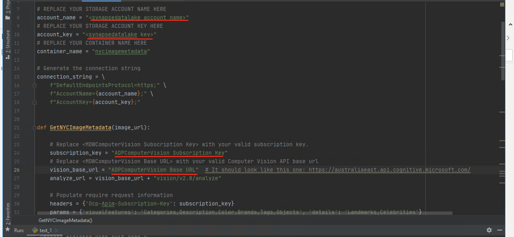
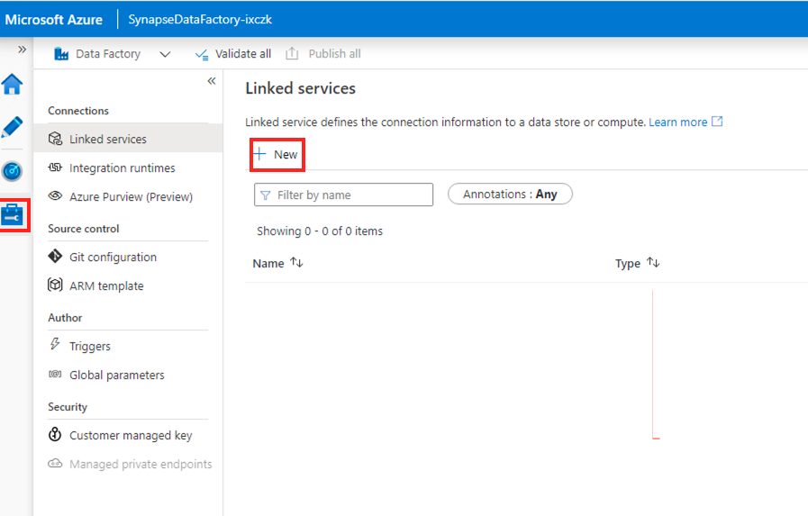
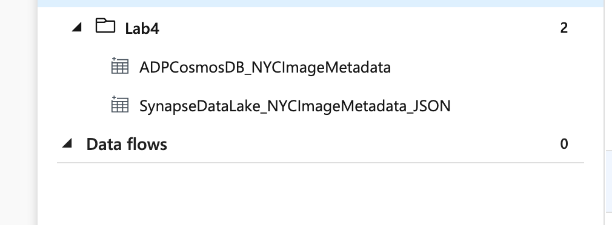
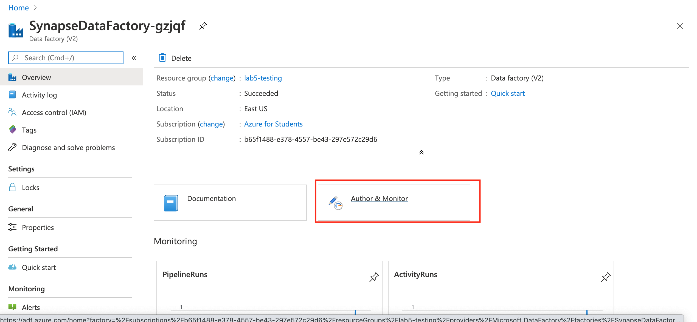
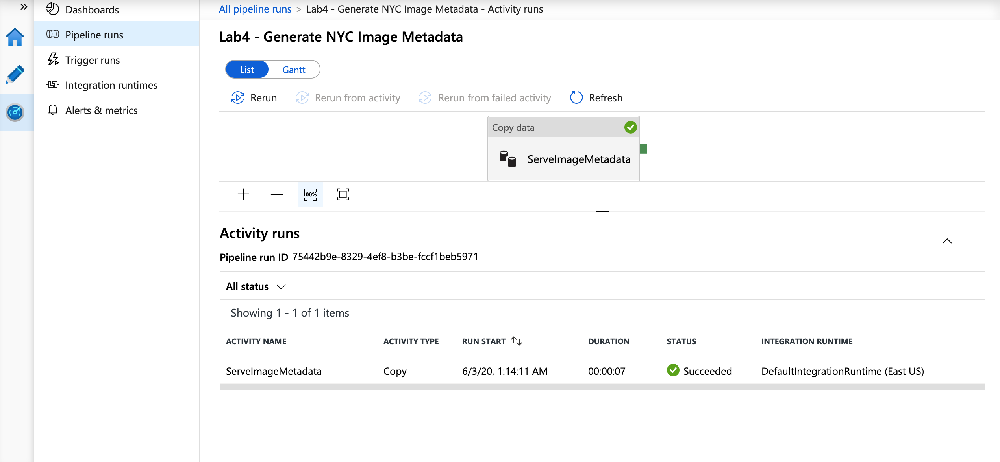

# Azure Data Platform - Cognitive Services

This tutorial will give you a hands on introduction to Microsoft Azure from the perspective of a Modern Data Analytics Platform by walking you through a use case for Cognitive Services. The tutorial is adopted from a 2 day workshop provided by Microsoft on their [Modern Data Analytics Platform](https://github.com/fabragaMS/ADPE2E).

**IMPORTANT**:

* The services covered in this course are only a subset of a much larger family of Azure services. Similar outcomes can be achieved by leveraging other services and/or features not covered by this workshop. Specific business requirements may also ask for the use of different services or features not included in this workshop.

* Some concepts presented in this course can be quite complex and you may need to seek for more information from different sources to compliment your understanding of the Azure services covered.

## Document Structure
This document contains detailed step-by-step instructions on how to implement Cognitive Services in a Modern Data Platform architecture using Azure Data Services. It’s recommended you carefully read the detailed description contained in this document for a successful experience with all Azure services. 

You will see the label **IMPORTANT** whenever a there is a critical step to the lab. Please pay close attention to the instructions given.

## This Workshop

In this workshop you will be making use of a custom pipeline to;
1. Download images of New York City to your Data Lake
2. Generate metadata regarding the images using Computer Vision Cognitive Service and store them back in your Data Lake
3. Transfer the metadata into Azure Cosmos DB for analysis
4. Visualise and analyse the data using Power BI.

**NOTE**: The original workshop made use of Azure DataBricks within Azure Data Factory to process the images, however due to the restrictions of the student account we will be using a custom Python Extraction Module on your Remote Desktop to run the Azure Computer V  ision Cognitive Services. Other options that could be used for this purpose are Azure Data Factory Custom Activities and Azure Functions, however they require advanced programming skills so we will not explore them in this workshop.

**IMPORTANT**: The typical use case for Cosmos DB is to serve as the operational database layer for data-driven applications (e.g. real-time personalisation). This workshop intends to illustrates how analytics data pipelines can be used to deliver insights to intelligent apps through Cosmos DB. For the sake of keeping this workshop simple we will use Power BI to query Cosmos DB data instead of an App.

## Microsoft Learn & Technical Documentation

The following Azure services will be used in this lab. If you need further training resources or access to technical documentation please find in the table below links to Microsoft Learn and to each service's Technical Documentation.

Azure Service | Microsoft Learn | Technical Documentation|
--------------|-----------------|------------------------|
Azure Cognitive Vision Services | [Process and classify images with the Azure Cognitive Vision Services](https://docs.microsoft.com/en-us/learn/paths/classify-images-with-vision-services/) | [Azure Computer Vision Technical Documentation](https://docs.microsoft.com/en-us/azure/cognitive-services/computer-vision/)
Azure Cosmos DB | [Work with NoSQL data in Azure Cosmos DB](https://docs.microsoft.com/en-us/learn/paths/work-with-nosql-data-in-azure-cosmos-db/) | [Azure Cosmos DB Technical Documentation](https://docs.microsoft.com/en-us/azure/cosmos-db/)
Azure Databricks | [Perform data engineering with Azure Databricks](https://docs.microsoft.com/en-us/learn/paths/data-engineering-with-databricks/) | [Azure Databricks Technical Documentation](https://docs.microsoft.com/en-us/azure/azure-databricks/)
Azure Data Lake Gen2 | [Large Scale Data Processing with Azure Data Lake Storage Gen2](https://docs.microsoft.com/en-us/learn/paths/data-processing-with-azure-adls/) | [Azure Data Lake Gen2 Technical Documentation](https://docs.microsoft.com/en-us/azure/storage/blobs/data-lake-storage-introduction)


## Workshop Flow

Step     | Description
-------- | -----
 | Use a custom Python Extraction Module to copy image files from shared Azure Storage
 | Save image files to your data lake
 | For each image in your data lake, invoke an Azure Databricks notebook that will take the image URL as parameter
 | For each image call the Azure Computer Vision Cognitive service to generate image metadata. Metadata files are saved back in your data lake
 | Use a Azure Data Factory Pipeline to copy metadata JSON documents into your Cosmos DB database
 | Visualize images and associated metadata using Power BI

**IMPORTANT**: Some of the Azure services provisioned require globally unique name and a “-suffix” has been added to their names to ensure this uniqueness. Please take note of the suffix generated as you will need it for the following resources in this lab:

Name	                     |Type
-----------------------------|--------------------
adpcosmosdb-*suffix*	     |Cosmos DB account
SynapseDataFactory-*suffix*	 |Data Factory (V2)
synapsedatalake*suffix*	     |Storage Account

## Create NYCImages and NYCImageMetadata Containers in Azure Blob Storage
In this section you will create a container in your SynapseDataLake that will be used as a repository for the NYC image files.

**IMPORTANT**|
-------------|
**Execute these steps on your host computer**|

1.	In the Azure Portal, go to the lab resource group and locate the Azure Storage account **synapsedatalake*suffix***. 
2.	On the **Overview** panel, click **Containers**.

    

3.	On the **synapsedatalake*suffix* – Containers** blade, click **+ Container**.   On the New container blade, enter the following details:
    <br>- **Name**: nycimages
    <br>- **Public access level**: Blob (anonymous read access for blobs only)

4.	Click **OK** to create the new container.

    

6.	Repeat the process to create the NYCImageMetadata container. This container will be used to host the metadata files generated by Cognitive Services before they can be saved in Cosmos DB.

    

7.	On the New container blade, enter the following details:
    <br>- **Name**: nycimagemetadata
    <br>- **Public access level**: Private (no anonymous access)
8.	Click **OK** to create the new container.

    

## Create CosmosDB database and collection
In this section you will create a CosmosDB database called NYC and a collection called ImageMetadata that will host New York image metadata information. 

**IMPORTANT**|
-------------|
**Execute these steps on your host computer**|

1.	In the Azure Portal, go to the lab resource group and locate the CosmosDB account **ADPCosmosDB-*suffix***. 
2.	On the **Overview** panel, click **+ Add Container**.
    
    

3.	On the **Add Container** blade, enter the following details:
    <br>- **Database id > Create new**: NYC
    <br>- **Container id**: ImageMetadata
    <br>- **Partition key**: /requestId
    <br>- **Throughput**: 400
    <br>- **Unique keys**: /requestId
4.	Click **OK** to create the container.

    

## Invoke Computer Vision Cognitive Services API through the custom Python Extraction Module
In this section you will use a python extraction module on the server to fill out the missing details about your Computer Vision API and your Data Lake account. The extraction module will be executed on the server using pycharm, the extraction module will invoke the Computer Vision API to generate metadata about the images and save the result back to your data lake.

**IMPORTANT**|
-------------|
**Execute these steps on your host computer**|

1. Open Pycharm on your Remote Desktop

2. Create a new Python File using MenuBar > File > New option

3. Choose Python File from File Templates

4. Copy the contents of the custom Python Extraction Module in Pycharm and open the custom Python Extraction Module in Pycharm. The script can be found in [<em>process_image_files.py</em>](https://docs.microsoft.com/en-us/azure/storage/blobs/data-lake-storage-introduction)

5.	On the script, the tag **Define function to invoke Computer Vision API**. You will need to change the function code to include the Computer Vision API details.

6.	From the Azure Portal, retrieve the MDWComputerVision subscription key and base endpoint URL.

    
    

7.	Copy and paste the Key and Endpoint values back in the custom Python Extraction Module script as directed.

8. In the **subscription_key** variable replace *&lt;ADPComputerVision Subscription Key&gt;* with the key you retrieved from step 6

9. In the **vision_base_url** variable replace *&lt;ADPComputerVision Base URL&gt;* with the key you retrieved from step 6

10.	In the **account_name** variable assignment replace *&lt;SynapseDataLake storage account name&gt;* with **synapsedatalake*suffix***.

    

11.	From the Azure Portal, retrieve the **SynapseDataLake*suffix*** access key.

    

12.	Copy and paste the Access Key into the custom Python Extraction Module scriptnotebook. Replace *&lt;account_key&gt;* with the Access Key you got from the previous step.

13.	Review the code.

14.	Run the custom Python Extraction Module by using Menu Bar > Run > Run 'process_image_files'

15.	After a successful execution you will notice that the new JSON files have been saved in the **NYCImageMetadata** container in your Data Lake.

16.	Navigate to Azure Portal and check the contents of the **nycimagemetadata** container in your **SynapseDataLake*suffix*** storage account.

17.	Download a file generated to inspect its contents.

## Create CosmosDB Linked Service in Azure Data Factory

In this section you will create a CosmosDB linked service in Azure Data Factory. CosmosDB will be used as the final repository of image metadata information generated by the Computer Vision API. Power BI will then be used to visualise the CosmosDB data.

**IMPORTANT**|
-------------|
**Execute these steps on your host computer**|

1.	Open the Azure Data Factory portal and click the **Author *(pencil icon)*** option on the left-hand side panel. Under **Connections** tab, click **Linked Services** and then click **+ New** to create a new linked service connection.

    

2.	On the **New Linked Service** blade, click the **Data Store** tab. 

3.	Type “Cosmos DB” in the search box to find the **Azure Cosmos DB (SQL API)** linked service. 

4.	Click **Continue**.

    

5.	On the New Linked Service (Azure Databricks) blade, enter the following details:
    <br>- **Name**: ADPCosmosDB
    <br>- **Connect via integration runtime**: AutoResolveIntegrationRuntime
    <br>- **Account selection method**: From Azure subscription
    <br>- **Azure subscription**: [select your subscription]
    <br>- **Cosmos DB account name**: adpcosmosdb-*suffix*
    <br>- **Database name**: NYC

    

6.	Click **Test connection** to make sure you entered the correct connection details. You should see a “Connection successful” message above the button.

7.	If the connection was successful, then click **Finish**. If you got an error message, please review the connection details above and try again.

## Create Azure Data Factory data sets.
In this section you will create 4 Azure Data Factory data sets that will be used in the data pipeline.

Dataset | Role| Description
--------|-----|----------
**MDWResources_NYCImages_Binary**| Source | References MDWResources shared storage account container that contains source image files.
**SynapseDataLake_NYCImages_Binary**| Destination | References your synapsedataLake-*suffix* storage account and it acts as the destination for the image files copied from MDWResources_NYCImages. 
**SynapseDataLake_NYCImageMetadata_JSON**| Source | References your synapsedatalake-*suffix* storage account and it acts as the source of image metadata files (JSON) generated by Databricks and Computer Vision. 
**ADPCosmosDB_ImageMetadata**| Destination | References ADPCosmosDB-*suffix* database that will save the metadata info for all images.



**IMPORTANT**|
-------------|
**Execute these steps on your host computer**|

1.	Open the Azure Data Factory portal and click the **Author *(pencil icon)*** option on the left-hand side panel. Under **Factory Resources** tab, click the ellipsis **(…)** next to **Datasets** and then click **Add Dataset** to create a new dataset.

    
    

2.	Create a dataset referencing the **NYCImages** container in your **synapsedatalake-*suffix*** storage account. 

3.	Type “Azure Blob Storage” in the search box and click **Azure Blob Storage**.

    

4.	On the **Select Format** blade, select **Binary** and click **Continue**.

    

5.	On the **Set Properties** blade, enter the following details:
    <br>- **Name**: SynapseDataLake_NYCImages_Binary
    <br>- **Linked Service**: SynapseDataLake
    <br>- **File Path**: **Container**: nycimages, **Directory**: [blank], **File**: [blank]

    

    Click **Continue**.

6.	Leave remaining fields with default values.

    
    Alternatively you can copy and paste the dataset JSON definition below:

    ```json
    {
        "name": "SynapseDataLake_NYCImages_Binary",
        "properties": {
            "linkedServiceName": {
                "referenceName": "SynapseDataLake",
                "type": "LinkedServiceReference"
            },
            "folder": {
                "name": "Lab4"
            },
            "annotations": [],
            "type": "Binary",
            "typeProperties": {
                "location": {
                    "type": "AzureBlobStorageLocation",
                    "container": "nycimages"
                }
            }
        }
    }
    ```

7.	Repeat the process to create another dataset, this time referencing the **NYCImageMetadata** container in your **synapsedatalake-*suffix*** storage account. 

8.	Type “Azure Blob Storage” in the search box and click **Azure Blob Storage**

    

9.	On the **Select Format** blade, select **JSON** and click **Continue**.

    

10.	On the **Set properties** blade, enter the following details:
    <br>- **Name**: SynapseDataLake_NYCImageMetadata_JSON
    <br>- **Linked Service**: SynapseDataLake
    <br>- **File Path**:  **Container**: nycimagemetadata, **Directory**: [blank], **File**: [blank]
    <br>- **Import Schema**: None

    

    Alternatively you can copy and paste the dataset JSON definition below:

    ```json
    {
        "name": "SynapseDataLake_NYCImageMetadata_JSON",
        "properties": {
            "linkedServiceName": {
                "referenceName": "SynapseDataLake",
                "type": "LinkedServiceReference"
            },
            "folder": {
                "name": "Lab4"
            },
            "annotations": [],
            "type": "Json",
            "typeProperties": {
                "location": {
                    "type": "AzureBlobStorageLocation",
                    "container": "nycimagemetadata"
                }
            }
        }
    }
    ```
11.	Leave remaining fields with default values.


12.	Repeat the process to create another dataset, this time referencing the **ImageMetadata** collection in your **ADPCosmosDB** database. 

13.	Type “Cosmos DB” in the search box and select **Azure Cosmos DB (SQL API)**. Click **Continue**.

    

14.	On the **Set properties** blade, enter the following details:
    <br>- **Name**: ADPCosmosDB_NYCImageMetadata
    <br>- **Linked Service**: ADPCosmosDB
    <br>- **Collection**: ImageMetadata
    <br>- **Import schema**: None

    

    Alternatively you can copy and paste the dataset JSON definition below:

    ```json
    {
        "name": "ADPCosmosDB_NYCImageMetadata",
        "properties": {
            "linkedServiceName": {
                "referenceName": "ADPCosmosDB",
                "type": "LinkedServiceReference"
            },
            "folder": {
                "name": "Lab4"
            },
            "annotations": [],
            "type": "CosmosDbSqlApiCollection",
            "typeProperties": {
                "collectionName": "ImageMetadata"
            }
        }
    }
    ```
15.	Leave remaining fields with default values.

    

16. Under **Factory Resources** tab, click the ellipsis **(…)** next to **Datasets** and then click **New folder** to create a new Folder. Name it **Lab4**.

17. Drag the previously created datasets into the **Lab4** folder you just created.

    

18.	Publish your dataset changes by clicking the **Publish all** button.

    

## Create Azure Data Factory pipeline to generate and save image metadata to Cosmos DB.

In this section you will create an Azure Data Factory pipeline to copy New York images from MDWResources into your SynapseDataLakesuffix storage account. The pipeline will make use of a python extraction module coupled with a Azure Data Factory pipeline to process each image and generate a metadata file in the CosmosDB database.

* The custom Python Extraction Module replaces the databricks component which was originally used, the DataBricks component is not available due to the limitations of the student subscription that you are using.


**IMPORTANT**|
-------------|
**Execute these steps on your host computer**|

1.	Open the Azure Data Factory portal and click the **Author *(pencil icon)*** option on the left-hand side panel. Under **Factory Resources** tab, click the ellipsis **(…)** next to **Pipelines** and then click **Add Pipeline** to create a new pipeline.

    
    

2.	On the **New Pipeline** tab, enter the following details:
    <br>- **General > Name**: Lab4 - Generate NYC Image Metadata
    <br>- **Variables > [click + New] >**
    <br>    - **Name**: ImageMetadataContainerUrl
    <br>    - **Default Value**: https://synapsedatalake[suffix].blob.core.windows.net/nycimages/
    **IMPORTANT**: Remember to replace the suffix for your SynapseDataLake account!

3.	Leave remaining fields with default values.

    

4.	From the **Activities** panel, type “Copy Data” in the search box. Drag the **Copy Data** activity on to the design surface. This copy activity will copy image files from shared storage account **MDWResources** to your **SynapseDataLake** storage account.

5.	From the Activities panel, type “Copy Data” in the search box. Drag the **Copy Data** activity on to the design surface. This copy activity will copy image metadata from the JSON files sitting on the NYCImageMetadata container in SynapseDataLake to the ImageMetadata collection on CosmosDB.

6.	Select the Copy Data activity and enter the following details:
    <br>- **General > Name**: ServeImageMetadata
    <br>- **Source > Source dataset**: SynapseDataLake_NYCImageMetadata_JSON
    <br>- **Source > File path type**: Wildcard file path
    <br>- **Source > Wildcard file name**: *.json
    <br>- **Sink > Sink dataset**: ADPCosmosDB_NYCImageMetadata

7.	Leave remaining fields with default values.

    
    

8.	Publish your pipeline changes by clicking the **Publish all** button.

    

9.	To execute the pipeline, click on **Add trigger** menu and then **Trigger Now**.

10.	On the **Pipeline Run** blade, click **Finish**.

    

11.	To monitor the execution of your pipeline, click on the **Monitor** menu on the left-hand side panel.

12.	You should be able to see the **Status** of your pipeline execution on the right-hand side panel.

    

13.	Click the **View Activity Runs** button for detailed information about each activity execution in the pipeline. The whole execution should last between 7-8 minutes.

    

## Explore Image Metadata Documents in CosmosDB
In this section you will explore the image metadata records generated by the Azure Data Factory pipeline in CosmosDB. You will use the Cosmos DB’s SQL API to write SQL-like queries and retrieve data based on their criteria.

**IMPORTANT**|
-------------|
**Execute these steps on your host computer**|

1.	In the Azure Portal, go to the lab resource group and locate the CosmosDB account **ADPCosmosDB-*suffix***. 

2.	On the **Data Explorer** panel, click **Open Full Screen** button on the top right-hand side of the screen.

3.	On the **Open Full Screen** pop-up window, click **Open**.

    

4.	On the **Azure Cosmos DB Data Explorer window**, under **NYC > ImageMetadata** click the **Items** menu item to see the full list of documents in the collection.

5.	Click any document in the list to see its contents.

    

6.	Click the ellipsis **(…)** next to **ImageMetadata** collection.

7.	On the pop-up menu, click **New SQL Query** to open a new query tab.

    

8.	On the **New Query 1** window, try the two different SQL Commands from the list. Click the **Execute Selection** button to execute your query.

```sql
SELECT m.id
    , m.imageUrl 
FROM ImageMetadata as m
```

```sql
SELECT m.id
    , m.imageUrl 
    , tags.name
FROM ImageMetadata as m
    JOIN tags IN m.tags
WHERE tags.name = 'wedding'
```

10.	Check the results in the Results panel.

    

## Visualize Data with Power BI
In this section you are going to use Power BI to visualize data from Cosmos DB. The Power BI report will use an Import connection to retrieve image metadata from Cosmos DB and visualise images sitting in your data lake.

**IMPORTANT**|
-------------|
**Execute these steps on your host computer**|

1.	Navigate to the Azure Portal and retrieve the **adpcosmosdb-*suffix*** access key.

2.	Save it to notepad. You will need it in the next step.

    

**IMPORTANT**|
-------------|
Execute these steps inside the **ADPDesktop** remote desktop connection|

1.	On ADPDesktop, download the Power BI report from the link https://aka.ms/ADPLab4 and save it in the Desktop.

2.	Open the file **ADPLab4.pbit** with Power BI Desktop.

3.	When prompted to enter the value of the **ADPCosmosDB** parameter, type the full server URI: https://adpcosmosdb-*suffix*.documents.azure.com:443/

4.	Click **Load**.

    

5.	When prompted for an **Account Key**, paste the ADPCosmosDB account key you retrieved in the previous exercise.

6.	Click **Connect**.

    

7.	Once data finish loading, interact with the report by clicking on the different images displayed and check the accuracy of their associated metadata.

8.	Save your work and close Power BI Desktop.

    
